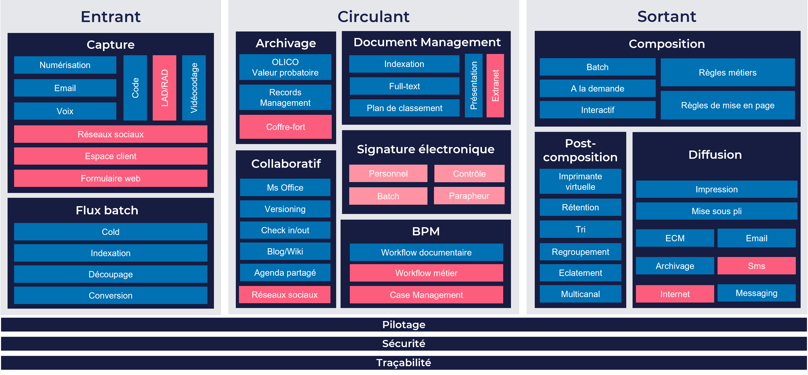

## 01 / Construire un référentiel documentaire

Socle fondamental d’une solution GED ou ECM, **le référentiel documentaire consiste à lister l’ensemble des types de documents produits, traités et diffusés au sein de votre organisation**, ou à destination de vos clients finaux. La clé de sa réussite réside dans la bonne connaissance du cycle de vie des documents et une définition précise de leurs métadonnées. **L’objectif d’un référentiel documentaire** est de pouvoir ensuite classifier et rechercher facilement les documents au sein de sa solution, gérer les chaînes d’approbation (workflows) ou encore assurer une diffusion automatisée de certains documents aux bons interlocuteurs.

Démarrer un projet GED/ECM sans référentiel documentaire expose votre entreprise à des risques : une information non structurée, la désorganisation des documents dans l’outil, une recherche aussi complexe que chronophage. En bref, un risque de non-adoption de la solution par les utilisateurs clés.

La construction d’un **référentiel documentaire** constitue donc un prérequis méthodologique essentiel au succès de la mise en place de votre solution GED ou ECM.  

## 02 / Cartographier ses flux d’information

Une fois le référentiel documentaire établi, vous disposez d’une première vue des documents qui circulent au sein de votre organisation. Une deuxième étape consiste à réaliser une cartographie des flux d’information pour enrichir la connaissance du fonds documentaire de l’entreprise : déterminer où sont stockés ces documents, sur quels supports, quelles informations sont utilisées et par qui, quels traitements sont appliqués, quels sont les volumes associés… **Le but est d’inventorier la répartition des échanges d’informations par type de traitement, par activité ou encore par type de support.**

**Cette cartographie permet d’avoir une meilleure compréhension de la circulation des documents et flux d’information au sein et entre les différents services, systèmes d’information et solutions technologiques.** Par exemple, un processus de traitement de factures fournisseurs implique généralement des échanges de données avec votre ERP voire d’autres système tiers dans votre écosystème SI. Il y a donc là un enjeu d’intégration de la solution de GED ou d’ECM avec vos systèmes. Il sera également essentiel de se pencher sur les canaux de réception des documents : email, EDI, courriers papiers… s’il s’agit de papier, il peut être nécessaire de faire intervenir une technologie OCR pour extraire les informations des factures.

**La cartographie des flux d’informations est d’autant plus importante à l’heure de l’omnicanal** où les collaborateurs et clients finaux ont la possibilité d’utiliser de nombreux canaux pour interagir. En cartographiant vos flux, vous disposez d’une vue exhaustive du cycle de vie des documents pour ne rien oublier lors de la mise en place de vos processus de gestion documentaire, que vous pourrez ensuite dématérialiser sereinement.

## 03 / Prioriser ses besoins et sa stratégie de déploiement

**Cette troisième étape méthodologique structure votre projet** en amont du choix de votre solution GED ou ECM. Il s’agit de hiérarchiser les besoins fonctionnels des utilisateurs, en fonction de votre objectif en matière de gestion de l’information. A travers l’utilisation d’une **grille d’analyse fonctionnelle**, l’exercice consiste à détailler vos besoins et mettre en lumière les composants à déployer en priorité selon l’impact métier, et le retour sur investissement attendu.

Une bonne pratique consiste à définir les fonctionnalités nécessaires en les classant par type de flux (entrants, circulants, sortants). Toutefois, bien qu’aidant pour structurer sa réflexion, il est important de garder à l’esprit que l’ensemble de ces flux sont interdépendants.  

* **Flux entrants** : il s’agit des flux de capture des informations entrantes (e-mail, numérisations, messages vocaux, réseaux sociaux, formulaires web, espace clients …) et des flux de traitement en masse, aussi appelé batch.
* **Flux circulants** : la réflexion concerne les flux liés à l’archivage (structure d’indexation et schéma de recherche contextuelle), la gestion des documents, leur authentification, leur intégration, ainsi que l’échange d’informations.
* **Flux sortants :** il est question de l’ensemble des informations et communications sortantes. Les interrogations concernent entre autres l’envoi des messages à la demande ou automatisé, le suivi des propositions, la rétention de documents, le regroupement d’informations…

Au terme de cette analyse, vos priorités sont bien définies, et les phases projet se dessinent. Vous disposez de tous les éléments pour avoir une vision exhaustive de votre futur solution GED ou ECM.

## 04 / Préciser le périmètre fonctionnel attendu pour déterminer la nature de la solution de gestion documentaire adaptée : GED ou ECM ?

Historiquement, la **GED (Gestion Electronique des Documents)**, revenait à réaliser une dématérialisation de ces derniers. C’est l’évolution technologique qui a fait émerger **l’ECM (Enterprise Content Management)**. Un terme anglo-saxon qui englobe la gestion du document, mais aussi de son contenu (information et métadonnées), et de l’analyse contextuelle qui peut en être extraite.

Au final, la décision est simple. **Si vous souhaitez stocker des documents, rechercher des informations et éventuellement en diffuser, une solution GED est préconisée**. En revanche, si votre activité inclut une dimension collaborative, l’utilisation de workflows, ou l’intégration d’outils tiers de l’écosystème de l’entreprise, tels que le CRM, l’ERP ou Office, le choix se porterait plutôt sur une solution ECM.

Progressivement, on voit aujourd’hui apparaître le terme de **CSP (Content Services Platform)** qui est le dernier élément de langage sorti par le cabinet d’analyse [Gartner](https://www.gartner.com/en) qui s’intéresse à la gestion de l’information. Il est question de plateformes complètes permettant de gérer les contenus en mode service. Pour en savoir davantage sur cette évolution, consultez notre article sur le sujet « **[L’ECM en route vers les Content Services : gérer ses contenus autrement](https://blog-consulting-and-integration.tessi.eu/posts/l-ecm-en-route-vers-les-content-services-gerer-ses-contenus-autrement)** ».

## 05 / Réfléchir au mode d’hébergement souhaité de la solution GED ou ECM

**Cloud, OnPremise, ou Hybride ?** L’essentiel est de bien connaître les avantages et inconvénients de chaque mode d’hébergement afin de choisir le plus adapté à vos besoins. 

Aujourd’hui, **une** **majorité d’éditeurs proposent des plateformes Cloud**. La facilité du « clé-en-main » est en effet indéniable : possibilité d’hébergement mutualisé, puissance de calcul, mises à jour fréquentes, disponibilité 24H/7j, étanchéité des données entre clients, délais de restauration courts en cas d’avarie majeure… Cela étant dit, les solutions Cloud étant principalement hébergées en Europe, des aspects réglementaires, tels que le RGPD, peuvent soulever quelques questions : qui est l’hébergeur de la solution ? s’agit-il d’un hébergement en propre chez l’éditeur ou ce dernier fait-il appel à des partenaires ? où sont situés les centres de données ? qui accèdent aux données et pour quoi faire ? Il y a donc une notion de conformité à considérer.

Si vous êtes amenés à traiter des données particulièrement sensibles, **une solution OnPremise** peut s’avérer davantage adaptée. L’infrastructure est dédiée au client, localisée dans ses murs, et assure un accès sécurisé aux données. Un avantage certes, mais qui exige de disposer en interne des **moyens et ressources nécessaires à la maintenance de la solution**. Cette contrainte doit bien être prise en compte avant de choisir ce mode d’hébergement.

**Quant à la solution hybride, elle agrège les avantages du Cloud et celles de l’hébergement sur site**, permettant l’utilisation des deux modes en simultané, selon les besoins. 

Nombreux sont les éditeurs de solutions logicielles à proposer ces trois types d’hébergement. La décision repose donc plutôt sur vos choix stratégiques et votre organisation interne, ou encore aux capacités de votre infrastructure informatique à supporter votre future solution GED ou ECM.  **Aucune option n’est meilleure que l’autre, mais l’une d’entre-elles sera plus adaptée selon chaque cas de figure.**

## 06 / Définir sa stratégie d’externalisation en fonction de ses objectifs et ses ressources internes

**Quand est-il conseillé d’externaliser et à quel degré d’autonomie pouvez-vous prétendre ?** La question mérite d’être posée, elle-même soulevant des interrogations de fond en termes de coûts et de ressources.

**En effet, la réalisation en interne est tentante.** Elle implique cependant des équipes possédant les compétences adéquates sur le long terme et une capacité à faire évoluer souvent et rapidement la solution. Les besoins métiers changeant fréquemment, les chefs de produits et autres spécialistes de l’outil n’hésiteront pas à demander des adaptations jugées aussi nécessaires qu’urgentes. Enfin, tout changement d’organisation, de paradigme ou de direction est susceptible d’impacter fortement les équipes techniques. Dans ce cas, qu’en est-il de l’évolution de la solution, ou même de sa « simple » migration ? 

Sachant qu’il existe aujourd'hui une large gamme d’outils ECM très puissants, qui embarquent une multitude de fonctionnalités régulièrement mises à jour par les éditeurs, **externaliser votre solution représente un réel gain de temps et de ressources**. Certaines solutions GED ou ECM vous permettent même d’être autonome sur le design de processus par exemple, pour faire évoluer l’outil à moindre coûts. Pensez à évoquer la question de l’autonomie qu’auront vos équipes sur la solution et sous quel délai, pour chaque solution envisagée.

## 07 / Choisir le type de solution adaptée : Buy, Build or Configure ?

Il existe un intérêt pour chacune d’entre-elles, encore une fois il s’agit ici de juger laquelle est la mieux adaptée à votre organisation et vos objectifs.

**La solution packagée et prête à l’emploi (BUY)** répond à un besoin bien défini par rapport à un type de document ou de processus. C’est le cas par exemple des factures fournisseurs pour lesquelles un outil clé en main génère les données pertinentes et le workflow adéquat. En revanche, ce type de solution ne saura répondre efficacement à des souhaits d’implémentations spécifiques. Le succès d’une solution BUY réside en effet dans la capacité à faire rentrer le besoin dans le standard.

**La solution de boîte à outils (BUILD)** offre, quant à elle, de nombreuses possibilités fonctionnelles et techniques permettant de faire de la « haute couture ». Toutefois, il s’agit d’une option évidemment plus complexe et longue à mettre en œuvre. Un point d’attention est bien sûr celui de la maintenance au long cours, une charge chronophage et couteuse à mettre en balance au moment de choisir !

**La solution low-code (CONFIGURE)** représente un entre-deux, puisqu’elle requiert davantage de paramétrages que de développement : plus flexible que l’outil clé en main et plus facile à mettre en œuvre que la solution BUILD, elle exige cependant une bonne connaissance des fonctionnalités ainsi que des possibilités et échéances d’évolutions prévues dans la roadmap éditeur.

Lire l’article : [« Quel mode de réalisation pour sa solution de Case Management : Buy, Build, Configure ? »](https://blog-consulting-and-integration.tessi.eu/posts/le-case-management-objectif-no-code)

## 08 / Choisir le modèle économique : Licence/maintenance ou souscription ?

**Si la tendance Cloud entraîne une propension importante à la souscription**, trois facteurs déterminants impactent le coût d’une solution logicielle, qu’elle concerne l’abonnement ou la licence :

* Le nombre d’utilisateurs de la solution GED/ECM
* Les fonctionnalités à la disposition des utilisateurs
* Le volume de documents gérés par la solution 

**Les solutions GED packagées relèvent bien souvent de modèles de souscription simples**, les briques logicielles étant facilement interchangeables. Les solutions ECM plus transverses et plus complexes demandent quant à elles plus de développements ou tout au moins une configuration plus avancée. Les investissements sur ce type de projet étant relativement plus importants, les licences perpétuelles permettant l’acquisition de la solution et de l’ordre d’usage ad vitam aeternam (sous réserve d’un paiement de maintenance annuel), sont parfois plus intéressantes. Demandez deux modèles de prix lorsque cela est possible et comparez !

**Dans tous les cas, avoir une vision à long terme concernant les évolutions de votre solution, et évaluer sa dimension stratégique au sein de votre organisation constituent des éléments essentiels à votre processus de prise de décision.**