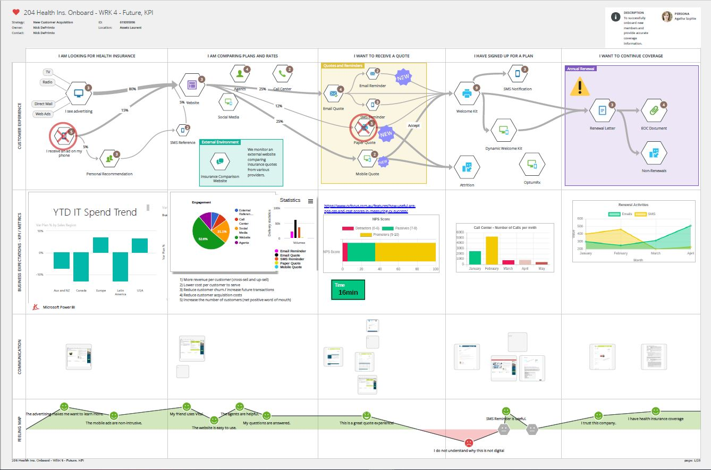
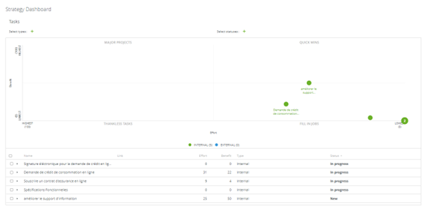
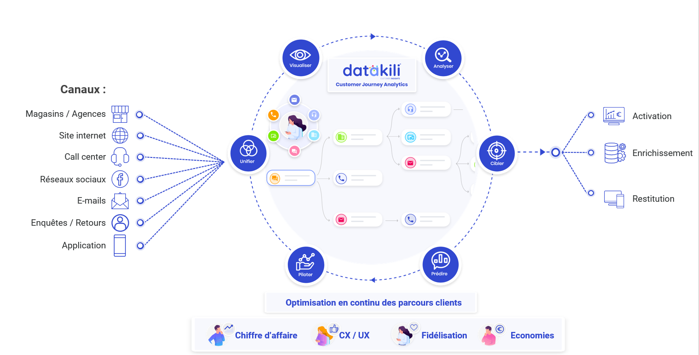
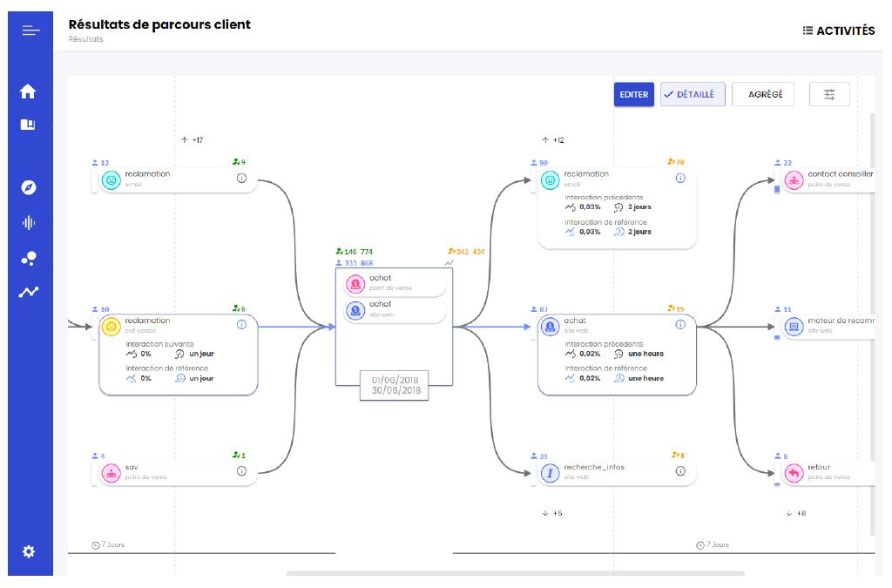

## 01/ Quelles solutions pour l’analyse de vos parcours client ?

Plusieurs approches peuvent être adoptées pour retracer les parcours de vos clients et les optimiser. Naturellement, il existe donc différents types de solutions permettant d’aboutir à la cartographie de ces derniers. Nous verrons dans cette article deux catégories d’outils, l’une plutôt manuelle et l’autre davantage automatisée.

### Les solutions de cartographie manuelle

Souvent caractérisé comme intuitives, simples d’utilisation, l’objectif de ces solutions est d’abord de **faciliter la représentation de chaque étape d’un parcours de façon visuelle et structurée** dans un cadre rigoureusement pensé.

Source : *Customer Journey Mapping, Quadient*

Ces outils sont un bon moyen pour modéliser plusieurs parcours spécifiques à différents métiers, qui pourront ensuite être consolidés au sein d’un parcours client macro pour obtenir une **vision de bout en bout**. Bien que pouvant être très détaillés, ces parcours ne peuvent représenter l’exhaustivité des parcours réels. Toutefois, ils ont l’avantage de pouvoir **traduire la complexité des parcours en un langage commun et accessible**, partageable à l’échelle de l’entreprise.

La liberté de cartographie offerte par ces solutions de « mapping » est également un point à noter. L’ajout de texte, d’objets, d’images, de tags et parfois même de KPIs dynamiques, laisse le champ libre d’**associer les informations souhaitées à chaque point de contact** : communications envoyées, types d’intéractions, satisfaction client, départements impliqués, processus métier engagés, types de traitement appliqués, etc.\
Dans le cas où vous souhaitez répondre à une problématique spécifique, vous pouvez ainsi orienter votre cartographie en choisissant minutieusement les informations à collecter et à représenter. A l’inverse dans une approche plus macro (ou en complément), vous pouvez utiliser votre cartographie de l’existant pour **définir votre expérience cible** en fonction de vos objectifs, vos principes de design et les valeurs de votre marque.

Construits à partir de **données déclaratives des métiers**, ainsi que de **données collectées** auprès des clients, ces solutions embarquent généralement avec elles des fonctionnalités **à dimension collaborative** permettant d’engager différents départements dans une perspective de co-construction, favorable au détricotage des silos et à la **conduite du changement**.

Source : *Customer Journey Mapping, Quadient*

Combinées à une **méthodologie et une équipe dédiée** en interne et/ou en externe, ces solutions permettent d’accéder à un premier niveau d’analyse pour détecter des irritants, poser la narration, prioriser, formaliser et planifier des chantiers au sein d’un **programme de transformation de l’expérience client. Il s’agit d’un premier pas vers une culture « customer centric ».**

### Les solutions de cartographie automatisée

Si l’expertise humaine reste un maillon indispensable au travail d’analyse des parcours, ce type de solutions portent l’ambition de **faciliter le travail de cartographie grâce à l’automatisation**. Parmi elles, nous pouvons citer [Datakili](https://datakili.com/?utm_source=tessi&utm_medium=article&utm_campaign=q1_2022), une technologie innovante membre de notre programme Pépite Shaker.

« Souvent les parcours au niveau d’un centre de contact ou sur un site e-commerce sont déjà très optimisés. Les gains significatifs se trouvent plutôt entre les canaux car c’est précisément là que le suivi et la mesure deviennent difficiles entrainant des ruptures dans les parcours. La promesse de Datakili est d’aller chercher le potentiel d’amélioration qui se cache précisément lors de ces changements de canaux, qu’ils soient digitaux ou physiques, en retraçant les parcours client de bout en bout. » explique Johan Evrard, Directeur Général de Datakili.

Basée sur un modèle de données flexible, il est à présent possible de **réconcilier les données propres à chaque point de contact malgré leur hétérogénéité** pour répondre à l’enjeu de cartographie des parcours en omnicanal. Une solution nouvelle génération, permettant d’optimiser des séquences de parcours spécifiques par canal mais également de **retracer les parcours réels des clients** dans toutes leur complexité et leur singularité à partir du moment où un flux de donnée est en place.

Cette vision 360° des parcours client s’accompagne d’une capacité de mesure propice à l’analyse dans une **approche data-driven**. Plusieurs angles d’analyse peuvent être pris : par cas d’usage (réclamation, souscription…), par gamme de produits, par canal, par campagne…\
Les parcours peuvent être comparés entre eux grâce aux **paramétrages d’indicateurs de performance** pour des séquences d’interactions données. Selon ses indicateurs, **l’intelligence artificielle** détecte l’efficacité et l’influence des parcours ou des interactions. De cette façon, elle permet d’éliminer le bruit parmi des milliers voire millions de parcours pour ne faire ressortir que les top séquences à fort potentiel. Ainsi, il est possible de **détecter plus aisément les irritants, les moments de vie et les parcours gagnants.**

Source : *datakili®*

Après la capacité à cartographier, explorer, analyser, un dernier volet est celui du pilotage et de l’activation. Le monitoring sur le long terme est permis par l’automatisation de la cartographie offrant la capacité à **suivre l’évolutivité des parcours**. Un autre avantage est celui de **la dimension prédictive** permettant d’anticiper certaines actions, de créer des segments à partir de séquences de parcours à risque ou à fort potentiel, et prendre des actions correctives à temps pour réorienter les clients vers des parcours plus vertueux.

## 02/ 3 bonnes pratiques pour analyser ses parcours client

Quel que soit la typologie de solution retenue pour vous accompagner dans l’analyse de vos parcours clients, quelques principes sont à retenir.

### Adopter une démarche itérative

**Une bonne pratique consiste à travailler cas d’usage par cas d’usage**. En priorisant ses objectifs et en évaluant la qualité et le potentiel d’exploitation de certains flux de données, il sera possible de définir le cas d’usage à traiter en premier.

Cette méthode qui consiste à commencer avec un seul cas d’usage est plus facile et rapide à mettre en place, car elle permet de resserrer le périmètre des données concernées. **C’est aussi un moyen de quantifier le ROI sur un projet aisé à mettre en place, pour convaincre sa direction générale de généraliser la démarche**.

#### Exemples de cas d’usage à forte valeur ajoutée

* **Fluidifier un parcours d’achat** pour augmenter son chiffre d’affaires
* **Réduire le nombre d’appels passés au call-center**, pour diminuer ses coûts de fonctionnement et améliorer la relation client, en identifiant les irritants à l’origine du nombre d’appels
* **Augmenter la satisfaction client**, en comparant les parcours de ceux qui se déclarent très satisfaits avec ceux qui le sont moins
* **Optimiser la relance commerciale** en identifiant les prospects à fort potentiel, ainsi que la période dans laquelle ils sont le plus susceptibles d’acheter. Découvrez le [cas MAIF](https://datakili.com/cas-dusage/maif/?utm_source=tessi&utm_medium=article&utm_campaign=q1_2022).

### Veiller à ce que les métiers gardent la main sur la modélisation des parcours client

Responsable de parcours, Product Owner, directeur de l’expérience client… Les métiers doivent avoir la main sur la modélisation des parcours client pour les analyser et prendre des actions concrètes régulièrement, dans une dynamique d’amélioration continue. **Lors du choix d’un outil d’analyse des parcours client, il est donc impératif de s’assurer de sa facilité d’utilisation pour assurer la prise en main par les métiers et leur autonomie**. Car finalement sans analyse, une cartographie n’a que peu de valeur. L’intérêt d’un tel projet réside dans l’interprétation des données et dans la décision des actions à prendre. Et pour l’instant, la technologie ne saurait prendre le relai.

### Industrialiser la relation client en omnicanal

Harmoniser la connaissance, homogénéiser certaines pratiques, détecter des opportunités d’automatisation de processus… l’analyse des parcours client est une des clés nécessaires à la **personnalisation en masse de la relation client**. Intégré à des solutions de CXM, telle que la plateforme technologique de l'offre [DIGITAL EXPERIENCE by Tessi](https://www.tessi.eu/fr/digital-experience-by-tessi/?mtm_campaign=digitalexperience_lancement&mtm_source=blog_tessijourney&mtm_medium=referral&mtm_content=article-tessi-datakili-methodes-outils), embarquant des outils de composition, de distribution omnicanale ou de centre de contacts, il devient par exemple possible d’automatiser le déclenchement de campagnes prédictives d’appels ou d’emailing. Un **moyen de maximiser le ROI** et **agir transversalement à l’échelle de l’entreprise**. Veillez donc à **l’interopérabilité** de votre future solution d’analyse des parcours client.