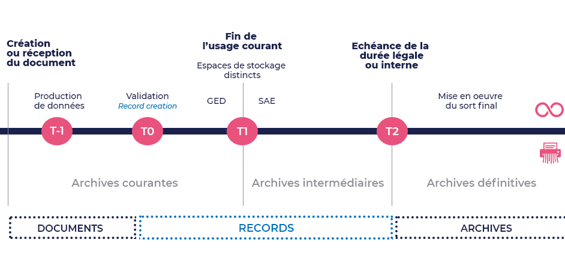

## Le cycle de vie d’un document

De sa création à sa destruction, le document passe par différentes phases telles que sa mise au point, sa conservation. Le cycle de vie d’un document est un concept utilisé en gestion documentaire, pour décrire **les différentes étapes menant de la production d’un document à sa destination finale**. Tous les documents n’ont pas la même valeur. Selon leur typologie, certains devront être conservés de façon illimitée, tandis que d’autres pourront être détruits au bout d’une certaine durée.

### Archivage : la théorie des trois âges

Du point de vue des archivistes, un document passe par trois phases au cours de son existence :

* **Archives courantes**: le document est conservé par les personnes l’ayant produit ou reçu, on s’y reporte quotidiennement.
* **Archives intermédiaires**: le document ne présente plus d’utilité quotidienne, mais ne peut néanmoins être détruit. Il est rangé et peut être consulté au besoin.
* **Archives définitives**: la conservation du document n’est plus nécessaire pour la conduite de l’activité et/ou sa conservation n’est plus légalement obligatoire. Il peut alors être détruit, ou confié aux archives définitives, pour des raisons patrimoniales ou historiques. Cette dernière possibilité concerne surtout les collectivités territoriales et autres services gouvernementaux.

### Le cycle de vie d’un document à l’aune du records management

Du point de vue du records management, le cycle de vie d’un document est polarisé autour de deux événements majeurs, venant modifier son statut et sa valeur :

* La **validation** qui donne au document sa nature engageante. Il s’agit du moment où le document est figé et validé dans sa forme finale, c’est la *record creation*. A partir de là, le document engageant doit être conservé dans un système sécurisé.
* L’événement déclencheur du sort final, qui permet de connaître la **date de fin de conservation**. Il peut s’agir de la fin de validité, d’une résiliation ou de la décision du responsable du contenu.

Le cycle de vie d’un document suit ainsi 5 étapes :

* La **création** ou la capture du document
* La **validation** du document, après que le document soit potentiellement passé par plusieurs états, selon les règles de nommage, le versionnage ou le contrôle de la diffusion
* **L’utilisation**, la diffusion et la publication du document
* **La fin de l’usage courant**
* **L’échéance légale** ou institutionnelle, en fonction de la durée d’utilité administrative

Document civil, document commercial, pièce comptable, document fiscal ou social… Selon la nature et la typologie du document, **la loi prévoit différentes durées de conservations**. Ainsi, la comptabilisation des horaires des salariés ne devra être conservée légalement qu’une année, alors qu’un contrat d’acquisition de bien immobilier devra être conservé 30 ans et un bulletin de paie 5 ans.

## Qu’est-ce que l’archivage ?

L’archivage désigne **l’ensemble des actions, des outils et des méthodes mises en œuvre pour conserver à moyen et long terme des informations**, dans le but de les exploiter. Qu’il soit physique ou numérique, l’archivage a vocation à assurer la pérennité, l’intégrité, la confidentialité et l’accès aux informations. Il intervient à partir du moment où le document a été validé comme document engageant.

Avec l’essor de la dématérialisation, l’archivage sous forme numérique a pris une importance croissante au sein des entreprises, et ce, sous plusieurs formes :

* Le **système d’archivage électronique (SAE)** qui regroupe, classe et référence au sein d’un unique outil informatique les différents flux documentaires, afin de les restituer facilement au besoin. Le SAE a peu à peu remplacé le rôle joué par le disque dur d’ordinateur personnel ou le serveur d’une entreprise. Sous cette forme, l’archivage numérique respecte la norme NF-Z42-013 de l’AFNOR, l’Association française de normalisation. Son pendant à l’échelle internationale est la norme ISO 14641. Pérennité, intégrité, confidentialité, disponibilité, réversibilité : en respectant ces 5 axes, le SAE permet de préserver la vocation probatoire des documents numériques archivés.
* Le **coffre-fort numérique** est un espace de stockage en ligne sécurisé, destiné à conserver les documents numériques. Le coffre-fort numérique peut être consulté et enrichi en ligne, via internet. Il permet de conserver les documents ainsi que leurs métadonnées pour en faciliter l’accès a posteriori. Lors du dépôt d’un document, une empreinte numérique y est apposée. Espace d’archivage à valeur probatoire, le coffre-fort numérique répond à la norme NF Z42-020.
* La **sauvegarde informatique** qui consiste à dupliquer les données archivées à l’identique, pour pouvoir les restaurer en cas de dommage ou de perte.

## Qu’est-ce que le records management ?

En français, le terme « archives » peut porter à confusion, car il désigne à la fois les archives historiques (« archives » en anglais) et les documents engageants que les entreprises ont l’obligation d’archiver (« records » en anglais). Le records management pourrait être traduit par « gestion de l’archivage » ou « archivage managérial ». **Le records management porte uniquement sur l’organisation de la conservation des documents de preuve et de gestion** pour les documents engageants que les entreprises doivent archiver afin de répondre aux obligations légales, défendre leurs droits et gérer leur mémoire. **A la différence de l’archivage, le records management ne concerne donc pas les archives historiques**.

Du point de vue du records management, un document peut avoir deux devenirs :

* Soit il devient un « record », c’est-à-dire qu’il est validé (donc figé et daté), reconnu comme important et déclaré comme devant être conservé.
* Soit il reste dans un état informatif sans rôle particulier en termes de preuve et n’a donc pas besoin d’être préservé. Il fait alors partie des « non records ».

A noter que les records ayant atteint leur échéance de conservation peuvent ensuite devenir des « archives » (à l’anglaise) et être alors conservés pour leur valeur patrimoniale.

**Dans un système de records management efficace, dès qu’un document engageant produit est validé alors il est archivé**. Dans ce système, il est donc possible de justifier la qualification de tous les documents conservés. Cela nécessite d’avoir défini au préalable une politique d’archivage.

Pour résumer, on pourrait dire que **le records management est une pratique d’organisation et de gestion qui prend en charge le contrôle systématique des documents engageants d'une entreprise tout au long du cycle de vie de ceux-ci**, qu'ils s'agissent de documents numériques ou physiques.

Le Records Management s’appuie donc sur des produits, des processus et des solutions logicielles afin de garantir la solidité de ces 6 piliers :

* Authenticité
* Fiabilité/Validité
* Intégrité
* Exploitabilité
* Conformité
* Exhaustivité

Les produits sont entre autres la signature électronique, l’empreinte, la gestion de processus, une architecture de stockage, un système d’archivage électronique. Archivage numérique et records management peuvent donc fonctionner ensemble. En plus de s’affranchir des coûts d’un archivage physique, l’archivage numérique permet d’optimiser les flux, en améliorant la traçabilité des documents et en y garantissant un accès simplifié. Bien archiver, c'est aussi des ressources humaines qui gagnent du temps au profit de tâches à plus forte valeur ajoutée.

***Au-delà de se conformer aux contraintes légales qui encadrent votre activité, coupler records management et archivage numérique permet de gagner significativement en performance à l’échelle d’une société. L’édition de factures au format numérique étant devenue obligatoire depuis 2020 (et ce n'est qu'un exemple parmi d'autres), les entreprises de toute taille ont tout intérêt à se pencher sérieusement sur leur processus d’archivage, pour embrasser peu à peu les bénéfices du records management et adopter un système d'archivage électronique.***