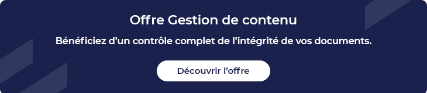

## 01/ Qu’est-ce qu’un coffre-fort numérique ?

Certifié sans intrusion possible, **le coffre-fort numérique est une solution de stockage d’informations dématérialisée ultra-sécurisée**. Aussi appelé coffre-fort électronique, le coffre-fort numérique permet de conserver les données telles qu’elles y ont été ajoutées, afin de pouvoir les restituer à l’identique à un utilisateur accrédité. **L’intégrité des données et leur confidentialité** représentent les principaux enjeux d’un coffre-fort numérique, **garant de la valeur probante** des documents numérisés qu’il conserve.

L’appellation « coffre-fort numérique » est contrôlée par la CNIL. Depuis le 1er janvier 2019, les services de coffre-fort numérique doivent répondre à des règles strictes, en termes de mise en œuvre du service et des conditions de récupération des documents stockés. Ainsi, à la différence d’un stockage numérique classique, **les données stockées dans un coffre-fort numérique ne doivent pas être accessibles à l’hébergeur**. Elles doivent être cryptées et seulement accessibles via une clé de déchiffrement par le client utilisateur. Plus globalement, un coffre-fort numérique doit offrir les fonctions suivantes :

* Dépôt, lecture et destruction des données
* Lecture des métadonnées techniques
* Contrôle de l’intégrité
* Lecture du journal des identifiants
* Listage de tout ou partie du contenu du coffre
* Restitution des données, en vue d’une lecture ou d’une destruction
* Indication de l’horodatage des versements 

### La différence entre coffre-fort numérique, GED et SAE

Gestion électronique des documents (GED), Système d’archivage électronique (SAE) et coffre-fort numérique sont trois solutions complémentaires concourant à la [dématérialisation des documents](https://blog-consulting-and-integration.tessi.eu/posts/dematerialisation-le-guide-complet).

#### La GED, Gestion électronique de documents

Acquisition, capture, numérisation, validation, diffusion, classement, archivage… **La GED permet d’optimiser la gestion des documents, en les rendant exploitables par des moyens électroniques**. L’enjeu principal n’est donc pas d’assurer l’intégrité des documents, mais bien d’améliorer leur utilisation au sein de l’entreprise. La GED représente donc un système informatique visant à améliorer la gestion des documents électronique dans leur utilisation quotidienne.

#### Le SAE, Système d’archivage numérique

Alors que la GED ne permet pas d’assurer la pérennité des documents, puisqu’ils peuvent être régulièrement modifiés, **le [SAE](https://blog-consulting-and-integration.tessi.eu/posts/sae-systeme-archivage-electronique-enjeux-mise-en-oeuvre) permet de conserver des documents validés, dont l'état doit dorénavant être figé.** En effet, une fois intégré dans un Système d’archivage électronique, un document ne peut plus être modifié. Les principaux enjeux d’un SAE sont donc d’assurer la sécurité, l’intégrité, la pérennité, la confidentialité et l’authenticité des documents qui sont stockés en son sein.

#### Le coffre-fort numérique

Elément complémentaire à un SAE, **le coffre-fort numérique représente un espace encore plus sécurisé pour la conservation des documents**. Cette sécurité accrue tient au fait que l’accès au coffre-fort numérique est limité à son seul utilisateur et aux personnes physiquement mandatées par ce dernier. Le coffre-fort numérique est donc une forme spécifique d’espace de stockage numérique, pouvant faire partie intégrante du SAE.

## 02/ Quels types de documents peut-on mettre dans un coffre-fort numérique ?

Documents administratifs, factures, relevés, contrats… De nombreux documents sensibles peuvent être archivés dans un coffre-fort numérique. Une telle solution permet de s’affranchir de l’archivage papier et des risques de perte ou de dégradation des documents qu’il comporte. **Le premier atout d’un coffre-fort numérique réside donc dans le gain de place, mais aussi dans le gain de temps** puisque l’accès aux données est largement simplifié, tout en étant parfaitement sécurisé. Document civil et commercial, pièces comptables, documents fiscaux ou relatifs à la gestion du personnel… Selon le type de documents, la loi fixe une **durée légale de conservation des documents** :

* 10 ans pour un contrat supérieur à 120 euros, conclu par voie électronique
* 30 ans pour un contrat d’acquisition ou de cession de biens immobiliers et fonciers
* 10 ans pour le registre comptable, à partir de la clôture de l’exercice
* 6 ans pour les éléments pouvant faire l’objet d’un contrôle de l’administration fiscale
* 5 ans pour le bulletin de paie d’un salarié
* 5 ans pour un contrat de travail
* Etc.

La liste complète des durées légales de conservation des documents est à retrouver sur le [site du gouvernement](https://www.service-public.fr/professionnels-entreprises/vosdroits/F10029). Parce qu’il assure leur pérennité et leur intégrité, **le coffre-fort numérique est la solution toute trouvée pour archiver ces documents soumis à des exigences légales de durée de conservation**.

## 03/ Conservation des documents : selon quels critères choisir un coffre-fort numérique ?

### Aspect légal

Toute solution de stockage de données en ligne ne peut pas se targuer d’être un coffre-fort numérique. En effet, la notion de « coffre-fort numérique » est une appellation contrôlée, définie par les articles L103 et L 122-22 du Code de la consommation. En outre, **un coffre-fort numérique doit répondre à la norme AFNOR NF Z 42-020**. Du versement à l’archivage, en passant par la consultation, la destruction ou la restitution de documents électroniques, cette norme précise les mesures techniques et organisationnelles à mettre en œuvre, dans des conditions qui garantissent l’intégrité des documents.

D’autres dispositions légales peuvent être prises en compte :

* Le décret du 30 mai 2018 pour la **garantie de la confidentialité** grâce au chiffrement des documents
* Le décret du 5 octobre 2018 sur la **réversibilité**
* La certification ISO 27001 relative à la **sécurité des systèmes d’information**
* La certification ISO 9001 relative aux **sites de stockage**
* Le **label délivré par la FNTC**, la Fédération des tiers de confiance du numérique, qui atteste du bon respect des processus d’horodatage, de calcul d’empreintes, de journal de preuves et de signature électronique

Selon la nature des documents à stocker, d’autres normes pourront être recherchées. Par exemple, l’agrément HADS (Hébergement agréé des données de santé) permet de stocker des documents liés à la santé, en toute sécurité.

### Aspects techniques

Pour une utilisation facile au quotidien, plusieurs aspects techniques doivent également guider votre choix.

#### Interopérabilité

**La capacité d’intégration de la solution avec vos applications métiers est un gage de réussite**. Un coffre-fort numérique relié à votre logiciel de paie permettra par exemple de verser les bulletins de salaire d’un simple clic. De l’interopérabilité dépend le versement automatique de documents, la supervision des flux et la fluidité de leur consultation. Il s’agit d’un point crucial.

#### Volume de documents

Tous les coffres-forts numériques n’ont pas la même capacité de stockage. Il convient d’en choisir un **adapté au volume de documents traités** au sein de votre entreprise.

#### Sécurité

Un coffre-fort numérique doit garantir **l’intégrité** des documents, en y apposant une empreinte numérique lors du dépôt. Il est également responsable de la **confidentialité** des données, via le cryptage, le contrôle d’accès et la traçabilité des utilisateurs y accédant. La **pérennité** du service dans le temps se fait grâce à des contrôles réguliers, ainsi qu’à la duplication du stockage. Ce n’est qu’ainsi qu’il est possible de préserver la **valeur probante** des documents. Enfin, le coffre-fort numérique doit permettre la **réversibilité**. Ce terme désigne le droit à la récupération des données déposées, de façon complète, intègre et dans un délai raisonnable.

Bien qu’hébergé fréquemment dans le cloud, un coffre-fort électronique doit répondre à des critères plus stricts que les services cloud classique. Ainsi, en plus de disposer de serveurs redondants, dont l’emplacement physique est surveillé et sécurisé, il faut être vigilant à la localisation géographique **des serveurs de stockage d’un coffre-fort numérique.** 

***Il existe aujourd’hui de nombreuses solutions de coffre-fort numérique. En tant que spécialiste de la gestion documentaire, et soucieux de la sécurité de vos documents, Tessi s'appuie sur des services de coffre-fort électronique à valeur probatoire conforme aux normes ISO 14641-1, NF Z 42-020 et une sécurisation fine des accès aux données. Votre coffre-fort ou vos coffres-fort individuels peuvent être hébergés au sein de nos datas centers Tiers III, certifiés ISO 9001 et ISO 27001 ou dans vos propres infrastructures. Notre savoir-faire d'intégrateur et la conception de nos plateformes assurent une capacité d'intégration maximale avec vos systèmes d'information et sont dotées d'une capacité de stockage quasi-infinie.*** 

