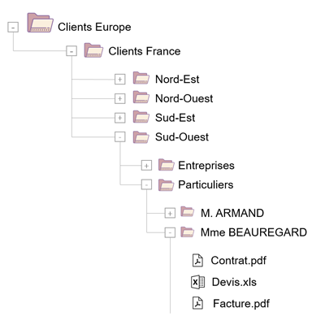

## 1. Quels sont les risques d’une GED mal structurée ?

**Une première erreur serait de proposer un unique plan de classement** à l’ensemble de l’entreprise, alors même que les besoins des utilisateurs varient d’un service à un autre. L’étape préalable à la mise en place d’une GED consiste donc à **étudier les différents usages**, afin d’identifier les points communs à l’ensemble de l’entreprise et de prendre en compte les aspects spécifiques des différents groupes d’utilisateurs. **Faire l’impasse sur l’analyse des besoins, c’est prendre le risque d’une mauvaise adoption de l’outil par les utilisateurs**. Face à une logique de stockage peu intuitive, les utilisateurs ne savent pas où stocker leurs documents ce qui peut entraîner plusieurs difficultés :

* Des documents mal rangés, difficiles à retrouver par les autres utilisateurs, ce qui **pénalise le travail collaboratif**
* Des risques de doublons
* Des difficultés à retrouver la version à jour d’un document
* **Une importante perte de temps et donc de productivité**
* De la **frustration** auprès des utilisateurs
* Un **risque de non-conformité** aux obligations légales d’archivage

Un document mal rangé à l’échelle d’un utilisateur peut paraître anodin, mais répliqué à l’ensemble d’une entreprise, cela peut vite donner lieu à une cacophonie sans nom. Pour éviter de se retrouver avec une GED désordonnée, il convient donc de structurer sa GED en fonction des besoins des utilisateurs.

## 2. Les différentes manières de structurer sa GED

Le classement consiste à ordonnancer des documents dans des catégories, selon une organisation logique, des méthodes et des règles de nommages, décrites dans un plan de classement. Pour les utilisateurs, le plan de classement ne doit pas être perçu comme une charge supplémentaire, mais doit faire partie intégrante de leur travail. En effet, étant donné qu’une GED a vocation à être utilisée au quotidien, tout l’enjeu est de **réussir à créer un espace de gestion documentaire permettant une prise en main rapide et une navigation intuitive**. Pour y parvenir, il existe différentes méthodes que nous vous proposons de passer en revue.

### Structurer sa GED par dossiers et sous-dossiers

Cette approche consiste à organiser sa gestion de documents selon une **arborescence précise** et des sous-dossiers en cascade. Par exemple, pour une entreprise française présente sur des marchés européens :

Cette approche présente **l’avantage de ressembler à l’organisation d’un disque dur**. Les utilisateurs habitués à l’organisation en place sur les disques locaux y trouvent facilement leurs marques. Cette arborescence unique et logique permet à chacun d’appréhender la structure. En revanche, **la structuration à plusieurs niveaux peut également sembler trop lourde pour les utilisateurs**. Découragés par la complexité de l’arborescence et l’hétérogénéité des règles de nommage, ils pourraient être tentés de mal ranger les documents, ce qui aurait pour conséquence d’être confronté aux problèmes évoqués précédemment : perte de temps, frustration, baisse de la productivité. **Ce type de hiérarchisation montre également ses limites à l’usage**. Il n’est en effet pas rare qu’un fichier doive légitimement se trouver à plusieurs endroits du plan de classement, selon le point de vue de l’utilisateur. C’est pourquoi il est intéressant d’utiliser les capacités d’indexation d’une GED, en mettant à profit les métadonnées.

### Structurer sa GED par métadonnées

Dans ce cas de figure, les documents sont regroupés au même endroit et catégorisés selon des paramètres précédemment établis. Au préalable, il convient donc de **concevoir une fiche d’indexation** afin de décrire le type de document. Il sera ainsi possible de définir des champs d’indexation avec des valeurs provenant de listes d’autorités, des choix de valeurs établies. Cette organisation matricielle permet de **retrouver rapidement tous les documents répondant à un critère donné**, via un moteur de recherche.

Il est ainsi possible de créer des vues, des **interfaces personnalisables**, afin de cibler les informations à faire remonter selon les métiers. **Associer à un document des métadonnées permet de le doter de caractéristiques qui seront parlantes selon l’activité et le besoin**. Puissant car non limité dans le nombre de champs et de valeurs d’indexation, ce mode de fonctionnement offre une utilisation beaucoup plus intuitive au quotidien. Il présente **néanmoins l’inconvénient de ne pas donner à voir la structure globale du plan de classement**. Or, cette vue d’ensemble peut manquer aux utilisateurs.

### Structurer sa GED par sous-dossiers et métadonnées

La dernière solution consiste à s’affranchir des défauts des deux méthodes précédemment évoquées, en n’en gardant que les avantages. Cette approche hybride permet de disposer d’une **structure par dossiers et sous-dossiers allégée, complétée par une recherche par métadonnées**.

## 3. Comment organiser sa GED pour maintenir son plan de classement ?

Voici une série de bonnes pratiques à suivre pour organiser sa GED de façon à maintenir son plan de classement :

* Mettre en place **un process obligeant les utilisateurs à passer par une bibliothèque de remise pour stocker le contenu sur la GED**.
* **Définir des règles au préalable pour mieux classer les contenus** (de façon homogène) et éviter les problèmes de versioning.
* **Automatiser le process de classement via les règles dites de rétention**. De cette façon, si le contenu ne répond pas aux règles définies ou si le document existe déjà, il n’y a pas d’abandon de document. L’administrateur peut être informé du problème par notification mail, afin d’évaluer la demande pour trouver la solution adaptée.

Ainsi, **l’utilisation devient intuitive**, car elle ne requiert pas d’appréhender une logique de stockage qui n’est pas facilement appréhendable par tous. En revanche, la mise en place d’une logique commune doit faire l’objet d’une **réflexion à entreprendre de préférence en amont de la mise en place de la GED**.

***Pour qu’elle soit efficiente, une GED doit toujours être paramétrée en fonction des besoins réels de l’activité. Mettre en place une structure adaptée, c’est s’assurer du respect de son plan de classement. L’organisation et les process d’une entreprise évoluant constamment, il est également important de faire régulièrement évoluer son plan de classement et ses outils d’indexation, pour une GED toujours à la page.***