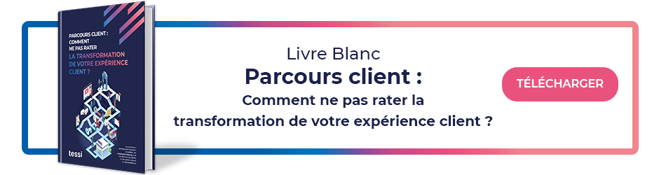

## 01/ L’omnicanal au cœur de l’expérience client

Par définition, l’expérience client est le sentiment né de l’ensemble des interactions d’un client avec une entreprise. Ce ressenti est donc fortement lié à la qualité du parcours client. Ainsi, agir positivement sur les émotions de vos clients, c’est maîtriser l’ensemble des paramètres et des variables de vos parcours. Une tâche rendue difficile par la complexité des parcours client d’aujourd’hui. Non seulement il faut être présent sur les canaux de choix de vos cibles, pour répondre à leur besoin d’interactions sans perturber leurs habitudes. Mais en plus, il faut répondre à l’exigence d’instantanéité des échanges. Dans ce contexte, l’omnicanal apparaît alors comme la meilleure stratégie à adopter pour améliorer l’expérience client. L’omnicanalité consiste à offrir une expérience unifiée, quel que soit le point de contact, physique ou digital. Votre client repère un produit qui l’intéresse en ligne, demande des informations sur ce produit via Twitter, reçoit une offre promotionnelle par mail, l’essaye et finalement l’achète en magasin. À tout moment, le discours et l’image de la marque est cohérent, sur chaque canal de communication, afin d’offrir une expérience « sans couture ».

## 02/ Parcours client omnicanal : comment se lancer ?

La première étape pour passer à l’omnicanal consiste à modéliser les différents parcours clients en fonction de vos personas et de vos gammes de produits et services. Vous devez alors recenser l’ensemble des points de contact, les canaux de communication qui s’y rapportent, les flux entrants et sortants, les départements impliqués, les moyens de communication disponibles, etc. Chaque point de contact doit être enrichi de données, collectées auprès de vos clients afin de représenter le champ émotionnel de ces derniers. Ainsi, vous êtes en mesure d’identifier les moments critiques et les moments de vérité sur lesquels agir. Une fois vos parcours modélisés, surtout ne vous arrêtez pas en si bon chemin, déterminez un plan d’action !

Si les situations diffèrent d’une entreprise à une autre, donnant lieu à des projets aux natures et aux objectifs différents, quelques bonnes pratiques demeurent.

### Fusionner les parcours en magasin et digitaux

Opposer le e-commerce aux points de vente physiques n’a plus de sens à l’ère de l’omnicanal. Désormais, les clients se renseignent en magasin avant d’acheter en ligne, ou inversement. Store-to-web, web-to-store, Click & Collect… il convient de créer des ponts entre le digital et le réel. Faire fusionner ces deux mondes comme s’ils ne faisaient qu’un. D’une part, c’est un moyen de multiplier les canaux d’acquisition de données clients pour une meilleure connaissance client. D’autre part, c’est une exigence client induite par leur comportement.

### Faire converger front et back-office

L’expérience client ne se limite pas au contact avec les collaborateurs de première ligne. Le back-office joue également un rôle important. Imaginons qu’un client repère une table basse qui l’intéresse sur votre site de e-commerce. Il souhaite l’acheter en magasin mais aimerait savoir si le magasin le plus proche de chez lui l’a en stock. Seul le back-office détient cette information. C’est pourquoi, dans une stratégie omnicanale, il est primordial que les systèmes d’informations back et front office communiquent entre eux. Garantir un partage optimum de l’information entre front et back office est un besoin absolu à l’égard des attentes clients.

### S’affranchir des silos organisationnels

L’ambition d’offrir une expérience fluide et unifiée de bout en bout à ses clients est inatteignable si des silos persistent au sein de votre entreprise. Une expérience client omnicanale doit être synonyme de vision à 360° du client, d’initiatives communes, de collaboration, de co-construction, d’un système informatique homogène et rationalisé, de solutions technologiques adaptées et d’une communication maitrisée à l’interne comme à l’externe. C’est pourquoi la création d’une entité coordinatrice des efforts liés à l’amélioration de l’expérience client est une pratique de plus en plus répandue. Elle agit comme un facilitateur en tant qu’entité centralisatrice. Bien que nécessaire voire même indispensable au-delà d’une certaine taille d’entreprise, elle ne sera cependant pas suffisante si elle n’a pas le soutien adéquat. Ce qui nous amène au point suivant.

### S’assurer que l’ensemble des collaborateurs se sentent concernés

Porteurs de projets d’expérience client, responsables clientèle, responsables marketing garants de l’offre, responsables communications, services IT… La mise en place d’un parcours client omnicanal est un projet transverse dont la réussite dépend de l’investissement de chacun. Cela passe d’abord par un soutien de la direction générale au travers de son plan stratégique, de son discours, et des moyens mis à disposition pour accompagner le changement. Un deuxième point important est l’intégration au projet des différents corps de métier, notamment lors de la modélisation des parcours client. Enfin, identifier vos ambassadeurs et s’inscrire dans une démarche d’amélioration continue sont des facteurs de réussite d’un programme d’expérience client.

### Vérifier la cohérence des communications tout au long du parcours client

Un parcours client doit être appréhendé de A à Z, du premier contact avec la marque à l’après achat. Un point important est donc de s’assurer de l’homogénéité des messages diffusés et de la cohérence visuelle sur l’ensemble des points de contact identifiés. Que l’on soit en points de vente physique ou digitaux, ce travail doit être effectué à la fois sur les communications marketing et sur les communications transactionnelles relatives à vos actes de gestion. Ainsi, il est possible de disposer d’une vision d’ensemble sur la gestion de sa communication client pour être toujours plus pertinent dans ses interactions.

***Tendre vers un modèle customer-centric ne s’improvise pas et la nécessité de passer à un parcours client omnicanal pour y parvenir n’est plus à démontrer. Tessi vous accompagne dans cette démarche en s’attachant à un triptyque vertueux entre solutions technologiques, optimisation des processus et considération de l’humain. Parce que le passage à l’omnicanal constitue un changement de paradigme, nous portons une attention particulière à l’évolution du système d’information et l’implication des métiers. Ainsi, nos équipes vous aident à modéliser vos parcours client et collaborateurs dans une logique de symétrie des attentions. Nous veillons à garantir la faisabilité technique des parcours modélisés en collaboration avec votre département IT. Nous vous recommandons des solutions sur-mesure pour atteindre votre expérience utilisateur cible. En résumé, notre pôle Conseil & Intégration vous aide dans la définition et la mise en place de votre stratégie omnicanale pour vous permettre, enfin, de mener des conversations continues avec vos clients.***

